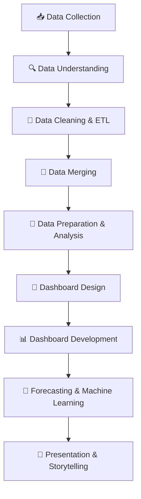

# 🚗 Egypt Car Accidents Analysis (2022 – 2024)

### Power BI • Excel • Python • Data Analysis • Forecasting

---

# 📌 Project Description

This project analyzes car accidents in Egypt from **2022 to 2024** using real datasets collected from the official website of the **Central Agency for Public Mobilization and Statistics (CAPMAS)**.

The project focuses on analyzing:
- Accident trends
- Injuries and deaths
- Emergency statistics
- Road safety patterns

The project also includes forecasting models using Python to predict future accident trends and support data-driven decision-making.

---

# 🎯 Project Objective

- Analyze car accident statistics in Egypt between 2022 and 2024
- Identify trends in injuries and deaths
- Compare accident categories and patterns
- Discover insights related to:
  - Gender
  - Age groups
  - Vehicle types
  - Road types
  - Monthly statistics
- Build interactive dashboards for storytelling and visualization
- Predict future accident trends using Machine Learning

---

# 📂 Project Files

🔗 [Google Drive Project Folder](https://drive.google.com/drive/folders/10C9qdOvMabBRY6b3wbOYhe-dZJVNiaE7?usp=sharing)

---

# 🛠️ Tools & Technologies

| Tool | Purpose |
|---|---|
| Excel | Data storage and organization |
| Power BI | Data cleaning, transformation, analysis, and dashboards |
| Python | Forecasting & Machine Learning |
| Figma | Dashboard UI/UX Design |
| Adobe Photoshop | Editing icons and dashboard assets |
| PowerPoint | Presentation & Storytelling |

---

# ⚙️ Project Workflow

---

# 📥 Data Collection

- Collected datasets from the official CAPMAS website
- Gathered:
  - 3 PDF reports (2022, 2023, 2024)
  - Population datasets for the same years

---

# 🔍 Understanding the Data

- Studied all tables carefully
- Determined the important datasets required for analysis
- Selected datasets related to:
  - Injuries
  - Deaths
  - Vehicle Types
  - Road Types
  - Gender
  - Age Groups
  - Monthly Statistics

---

# 🧹 Data Cleaning & ETL Process

The datasets were imported into **Power BI Power Query** and processed using ETL techniques:

- Extract
- Transform
- Load

## 🚨 Challenges During Cleaning

- Headers existed inside rows
- Large amount of null values
- Inconsistent table structures
- Different spellings for governorate names

## ✅ Cleaning Process

- Cleaned each year separately
- Standardized governorate names and text formatting
- Fixed data types
- Removed unnecessary rows and columns
- Prepared clean datasets for analysis

---

# 🔗 Data Merging & Structuring

Initially, the project contained:

- 30 Tables
  - 15 Injuries Tables
  - 15 Deaths Tables

## 🔄 First Merge

Merged the same category across all years.

### Example
- Injuries by Gender
- Injuries by Vehicle Type
- Injuries by Road Type
- Monthly Statistics

### ✅ Result

30 Tables → 10 Tables

---

## 🔄 Final Merge

Merged injuries and deaths datasets for each category.

### ✅ Final Output

10 Tables → 5 Final Tables

The data then became fully ready for analysis and visualization.

---

# 🏗️ Dashboard Development

To improve performance and project organization, the project was divided into two separate Power BI files.

## 📂 Data Cleaning File

Used for:
- ETL Process
- Cleaning
- Data preprocessing

## 📊 Dashboard & Analysis File

Used for:
- DAX Measures
- Dashboard Development
- Visualizations
- Analysis

This approach improved dashboard performance and workflow organization.

---

# 📐 Data Preparation & Analysis

- Organized and prepared the datasets for analysis inside Power BI
- Built relationships between tables to improve dashboard performance
- Created DAX measures for:
  - KPIs
  - Comparisons
  - Percentages
  - Dynamic calculations
- Prepared the final datasets for dashboard visualizations and reporting

---

# 🎨 Dashboard Design

### 🖌️ Design Tools

- Figma → Dashboard Layout & UI/UX
- Photoshop → Editing icons and visual assets

---

# 📄 Dashboard Pages

| Page | Description |
|---|---|
| Intro Page | Project introduction |
| Overview | General accident statistics |
| Injuries Analysis | Injury trends and analysis |
| Deaths Analysis | Death trends and insights |
| Comparison Analysis | Comparisons between categories |
| Ambulance Analysis | Emergency and ambulance analysis |
| Ambulance Points Analysis | Ambulance locations and coverage |

---

# ✨ Dashboard Features

✔️ Interactive Filters & Slicers  
✔️ Tooltips for Important Charts  
✔️ Interactive Navigation  
✔️ KPI Cards  
✔️ Dynamic Comparisons  

---

# 📸 Dashboard Preview

> Add dashboard screenshots here

---

# 🤖 Forecasting & Machine Learning

After completing the dashboard analysis, the project moved to Python for forecasting.

## 🔬 Steps Performed

- Exported clean data from Power BI
- Tested model performance and accuracy
- Built forecasting models for:
  - Accident trends
  - Injury rates
  - Death rates

---

# 📈 Forecasting Results

The forecasting models indicated that:

- Accident rates are expected to increase over time
- Death rates are also expected to increase in future years

---

# 📊 Key Insights

- Accident rates increased across the analyzed years
- Male injury rates were significantly higher
- Certain road types recorded higher accident frequencies
- Forecasting models predicted continued increases in accidents and deaths

---

# 📖 Presentation & Storytelling

The final presentation was created using **PowerPoint** and focused on:

- Problem Explanation
- Key Insights
- Dashboard Storytelling
- Forecasting Results
- Recommendations

---

# 👥 Team Members & Responsibilities

| Team Member | Role |
|---|---|
| Mohamed Nasser Abd El Basset | Team Leader, Presentation, Project Coordination, and Supporting All Project Phases |
| Ahmed Abdelrhman Hassan | Forecasting & Machine Learning using Python |
| Youssef Ahmed Ibrahim | DAX Measures & Calculations |
| Sara Basher Selem | Data Cleaning, Data Preparation, and Data Storage |
| Mariam Mohammed Abdelmalek | Data Cleaning, Data Preparation, and Data Storage |
| Tasneem Reda Gomaa | Dashboard Development & Dashboard Design |

---

# 👨‍🏫 Instructor

### ENG. Karim Bakly

---

# ⏳ Project Timeline

| Phase | Duration |
|---|---|
| 📥 Data Collection | 2 Days |
| 🔍 Understanding the Data | 1 Week |
| 🧹 Data Cleaning, Preparation & Merging | 1 Month |
| 📊 DAX Measures & Calculations | 1 Week |
| 🎨 Dashboard Design & Development | 3 Days |
| 🤖 Forecasting & Machine Learning | 2 Days |
| 📖 Presentation & Storytelling | 3 Days |

---

# 🚀 Total Project Duration

## Approximately 2 Months

---

# 📌 Final Outcome

The project successfully transformed raw governmental accident reports into a complete analytical solution that includes:

- ✅ Clean and structured datasets
- ✅ Interactive Power BI dashboards
- ✅ Forecasting & Machine Learning models
- ✅ Professional storytelling presentation

The final solution provides valuable insights into road accidents in Egypt and supports future road safety improvements and data-driven decisions.

---

# ⭐ Project Status

## ✅ Completed Successfully
